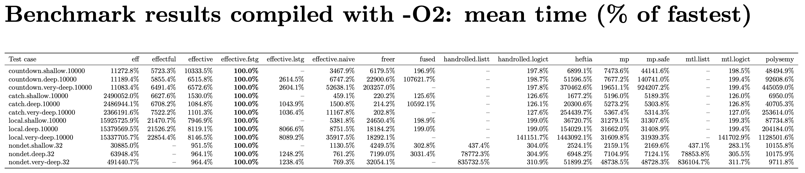
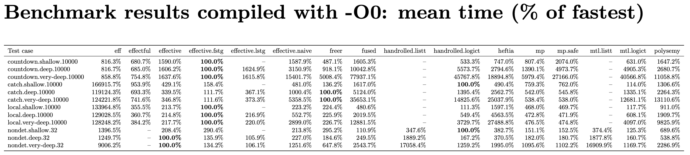

Experiment Setup
================

This benchmark suite is for evaluating the runtime performance of the [`effective`](https://github.com/zenzike/effective) library. The following Haskell effect libraries are also benchmarked for comparison: `eff`, `effectful`, `freer-simple`, `fused-effects`, `mpeff`, `heftia`, and `MTL` (with `LogicT` or `ListT` for nondeterminism).

The test cases (in `bench/Bench/`) are adapted from the benchmarking suite of [heftia-effects](https://hackage.haskell.org/package/heftia) with the following modifications:

1. The test of coroutine is removed because the bottleneck is in the actual computation rather than the effect framework.

    We added a new group of tests called `very.deep` where there are 50 reader effects before and after the effect handler being tested. This group of tests needs a lot of memory to compile so it is disabled by default in `effective-bench.cabal`. The library `fused-effects` is disabled for `very.deep` because it fails in compilation because of running out of simplifier ticks.

2. Beside the implementations of `effective`, we also add another implementation for hand-rolled monadic code that does not use the `MonadXYZ` type-classes. In the benchmark suite of [heftia-effects](https://hackage.haskell.org/package/heftia), the test cases `catch` and `local` are not implemented for libraries that do not support higher-order effects. We added these tests for all libraries by implementing `catch` and `local` as handlers.

3. The `NOINLINE` pragmas in the test cases are removed. Instead we create two benchmarks `with-o0` and `with-o2` for different optimisation levels. Note that we pass `O2` to all packages in `cabal.project`, so in the benchmark `with-o0`, it is the testing programs receiving `O0` but the libraries are still compiled with `O2`. This is probably a more realistic scenario than everything being unoptimised.

4. We separate the libraries into different compilation units to make sure that each of them receives the same amount of simplifier ticks.

5. The handlers for state and reader of `Mp.Eff` internally use `IORef` and `unsafePerformIO` to store the state. So we create a separate test `mp.safe` where state are handled in the usual way as state-passing functions.

6. GHC is pinned to 9.10.1 and all libraries are pinned to specific versions in `effective-bench.cabal` for reproducibility. GHC 9.8.4 was also tested. All libraries compile without modification with 9.8.4 but `mp` and `mp.safe` crash at runtime, which should be caused by GHC bugs (since they don't crash with 9.10.1).

7. The library `freer-simple-1.2.1.2` is slightly patched to compile with GHC 9.10.1.

    1. `freer-simple.cabal` is modified to allow the version of `template-haskell` that ships with GHC 9.10.1

    2. Line 156 of `src/Control/Monad/Freer/Internal.hs` is changed from

        ```
        instance (MonadBase b m, LastMember m effs) => MonadBase b (Eff effs) where
        ```
        to

        ```
        instance (Monad b, MonadBase b m, LastMember m effs) => MonadBase b (Eff effs) where
        ```

       It's not clear to me why GHC 9.10.1 can't see `MonadBase b m` already implies `Monad b`. The patched version is shipped in `vendor/freer-simple-1.2.1.2`.

In the deep and very deep tests for `effective`, we use the handler combinator `++>` instead of our usual fusion combinator `|>` because `effective` is designed to work with _effect sets_ that have no duplicated members, but the deep and very deep tests of this benchmark introduce duplicates of reader effects. For a fair comparison, the combinator `++>` is added to `effective`, which _appends_ effects rather than _unions_ effects when fusing two handlers.

How to run
==========

The shell script `runbench.sh` runs the benchmarks. The benchmarking framework [`tasty-bench`](https://hackage.haskell.org/package/tasty-bench) automatically runs each test case multiple times for a target relative standard deviation of 5%.

All results are generated in the directory `results/`. The raw data are recorded in `o0-results.csv` and `o2-results.csv`. The script also generates some `pdf` files (using LaTeX) for showing the results more nicely. The file `results/benchmark-tables.pdf` collects all tables in a file.

Results
=======

The files in `results/` shipped with this repo were generated on an Apple M4 laptop with 24GB memory. On this machine, it took around 20 minutes to compile the tests and 10 minutes to run the tests with the very deep tests enabled (and it would be much quicker when deep tests are disabled). The results are shown in this file [`results/benchmark-tables.pdf`](results/benchmark-tables.pdf). Among all results, the following two tables are probably the most interesting, showing the average running time relative to the fastest implementation:





The dashed entries are due to the following reasons:

* `effectful` doesn't support multi-shot handlers so it doesn't have a result for `nondet`.

* `effective.lstg` (`effective` with light staging) doesn't have results for shallow tests because it is exactly the same as non-staged `effective`.

* `handrolled.listt` and `mtl.listt` only have results for `nondet` because they have exactly the same results as `handrolled.logict` and `mtl.logict` for tests that do not involve nondeterminism.

Analysis
========

**First of all, we emphasise that the results of this experiment do not necessarily generalise to practical scenarios because the testing programs are all small artificial toy programs, and the comparison between the implementations is not strictly an apples-to-apples comparison because the libraries do not implement exactly the same API.** For example, `mp` and `freer` are not libraries designed for higher-order operations, so we implement `catch` and `local` as handlers rather than re-interpretable operations for them, which gives certain advantages in these tests.

The main purpose of this experiment is to check that our implementation of `effective` has the expected performance characteristics, rather than to compare the performance of the different libraries in a comprehensive way. However, we can still draw some useful conclusions from these small tests.

The following are some observations about (different ways of using) `effective`:

* Fully staged `effective` (`effective.fstg` in the tables) are the fastest in the majority of the test cases under both `O2` and `O0`. This is not surprising because if we inspect the generated code, it is clear that the code for `effective.fstg` is overhead-free. For example, the generated code for the `countdown` test (slighted reformatted) is
  ```haskell
  countdownDeep :: Int -> (Int, Int)
  countdownDeep n = runIdentity (runStateT p n) where
    p = StateT (\ s ->
              if (s > 0) then
                  runStateT p (s - 1)
              else
                  Identity (s, s))
  ```
  The operations `get` and `put` and the (unused) reader effects are all evaluated away at compile time.

  Only for `nondet` and `catch` in `O0`, `effective.fstg` is not the fastest. For `nondet` we believe that this is because `effective.fstg` generates code operating on vanilla lists `[a]`, while faster implementations use CPS-based lists. It is possible to change `effective.fstg` to generate code using CPS-based lists as well.

  For `catch`, we are not sure why `effective.fstg` is slightly slower than `mtl` or `freer` under `O0` while the generated code looks already optimal:
  ```haskell catchDeep :: Int -> Either () ()
  catchDeep n = runIdentity (runExceptT (p n))
    where
      p :: Int -> ExceptT () Identity ()
      p m = ExceptT
        (if (m > 0) then
             case runIdentity (runExceptT (p (m - 1))) of
               Left a_a6mr -> Identity (Left ())
               Right b_a6ms -> Identity (Right b_a6ms)
         else
             Identity (Left ()))
  ```

* Lightly staged `effective` (`effective.lstg` in the tables) does not offer performance boost in these tests. This is because there is no non-trivial handler interaction in these tests, so handler combinators aren't in any hot path of the tests.

* Non-staged `effective` performs reasonably fast compared to other implementations of effect handlers under both `O0` and `O2`. It is not always the fastest in the shallow tests but it does very well in the deep and very deep tests because of handler fusion and storing algebras as arrays.

* The version of `effective` with the naive encoding of programs and algebras (`effective.naive`) does better than `effective` under `O2` for shallow tests. It is because GHC is willing to do more inlining for `effective.naive`, while it almost never inlines anything related to arrays.

The following are some additional remarks about implementations other than `effective`:

* Contrary to some claims online, `MTL` is not slow when optimisations is on. Most of the time GHC inlines typeclass members at use sites. Indeed, in our `O2` experiment `MTL` is quite fast in all tests except for `local.very-deep`, for which GHC gives up inlining. The real problem with `MTL` is inflexibility: the operations and monad transformers are tied to each other rigidly.

* The performance of `fused-effects` is similar to `MTL`: when inlining happens it is very fast, otherwise it is very slow. However, `fused-effects` is less inlining-friendly compared to `MTL`. It even exhausts the simplifier ticks of GHC for very deep tests.

* Apart from our `effective`, `effectful` is another implementation that is consistently unaffected by adding layers of reader effects. This is because the monad of `effectful` is simply a reader monad `newtype Eff es a = Eff (Env es -> IO a)` (as a result it does not support the effect of nondeterminism).

* In the tests `local` and `catch`, `freer` and `mp` are unaffected by adding layers of reader effects because `local` and `catch` are implemented as handlers rather than re-interpretable (higher-order) operations for `freer` and `mp`. Therefore when the reader handlers get to handle the program, the program has already been processed into a single-operation program. Thus the layers of reader handlers hardly affect the performance. But in the tests `countdown` and `nondet` we can see that adding layers of reader effects does affect the performance of `mp` and `freer` linearly.

* For `mp` and `mp.safe`, we observe that there is indeed a noticeable performance drop in the `countdown` test from `mp` to `mp.safe` because the safe handler of state is not tail-resumptive, while `mp` is optimised for tail-resumptive handlers.

* It seems that `eff` is unaffected by adding layers of reader effects when the handlers are single-shot, but it is affected in the `nondet` test cases (where the handler is multi-shot).